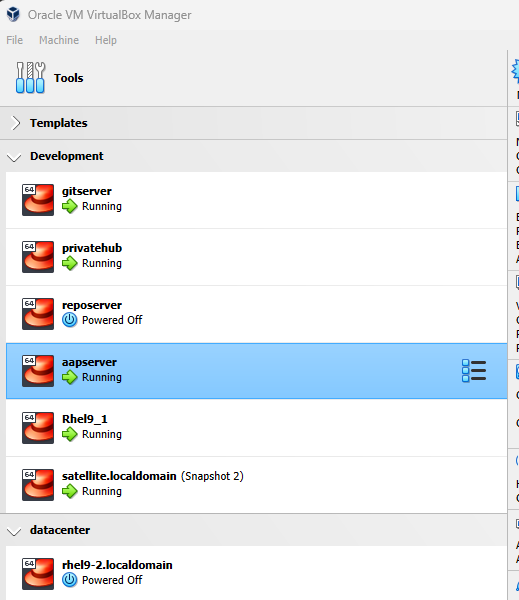
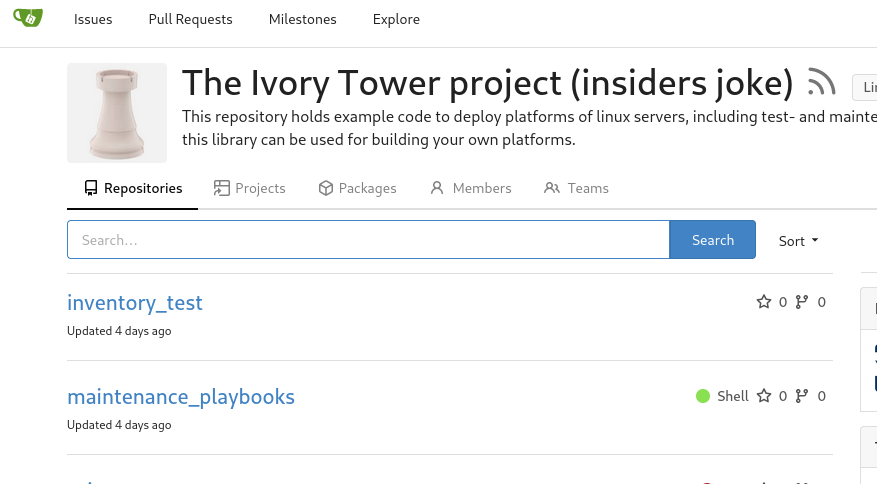
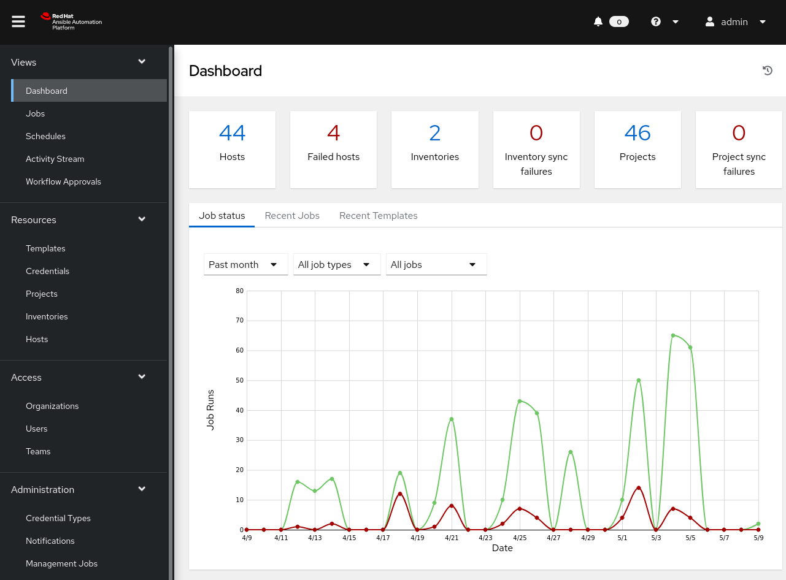
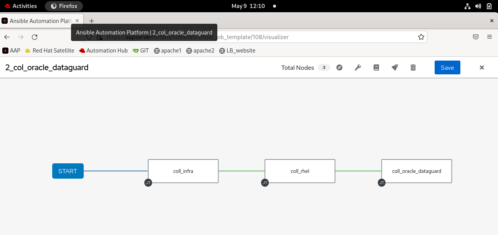

# What does a lab in a box look like?

When you followed the steps in this documentation it could look like the screenshots below.
In this lab a full Enterprise like stack is built and running on a game laptop, so I can take it anywhere and play, demo or develop ansible code. For a complete enterprise setup some things are missing like LDAP servers, but with enough resources, anything is possible.

Im my case it runs on Oracle Virtualbox under windows, but it is easily adapted to libvirt under linux, just add a new role to the infrastructure and adapt the inventory accordingly.

## The virtualbox manager screen
By grouping the virtual machines, you can easily create an overview on all VM's.
- Templates are my prebuilt box VM's that I can update and re-export for box updates.  
- Development are my management systems  
- Datacenter is where all my VM's will be deployed.  

  
## gitea in action
The Ivory_tower Project is the project in which all my code repositories reside, regarding ansible.
Gitea can host a lot of projects...this is but one of them.

  

## Ansible Atomation Platform home
I use my Automation Platform for testing and redeploying machines.
As you can see, noting ever is perfect..
  

## Ansible Automation Platform workflow
The worklfow you see here, is just 3 nodes, but counting the repositories used in all plays there are 21 separate repositories used to build this workflow.
  

Biulding this is the fun part, watching it run.....(look mammy..no hands) boring....

